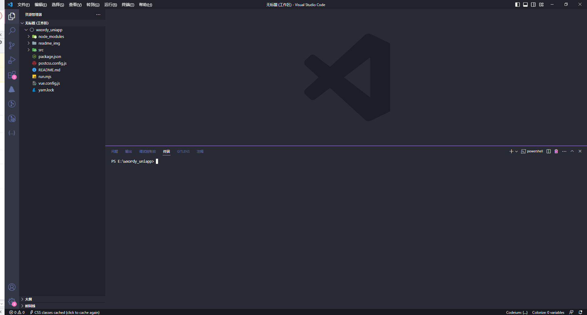
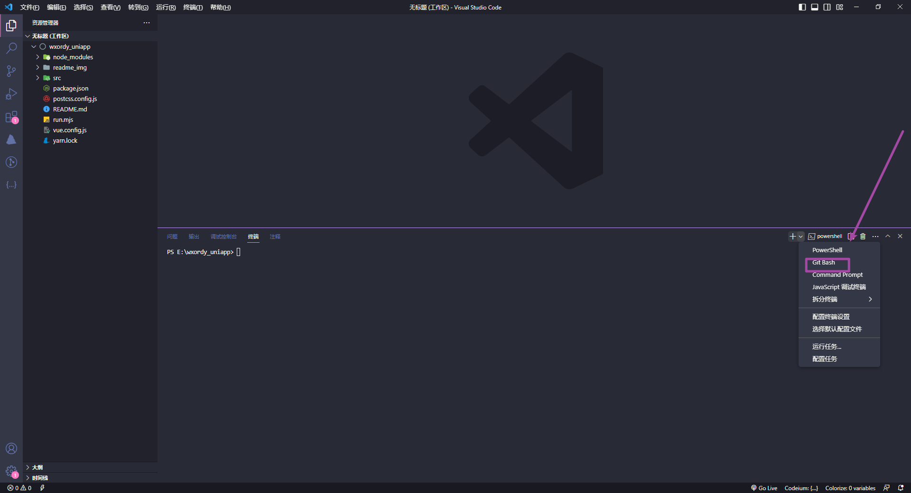
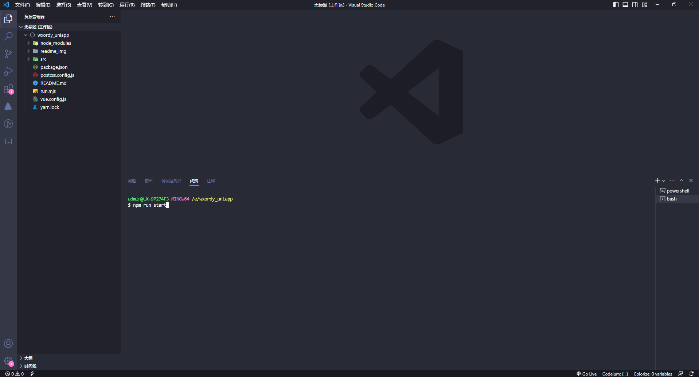
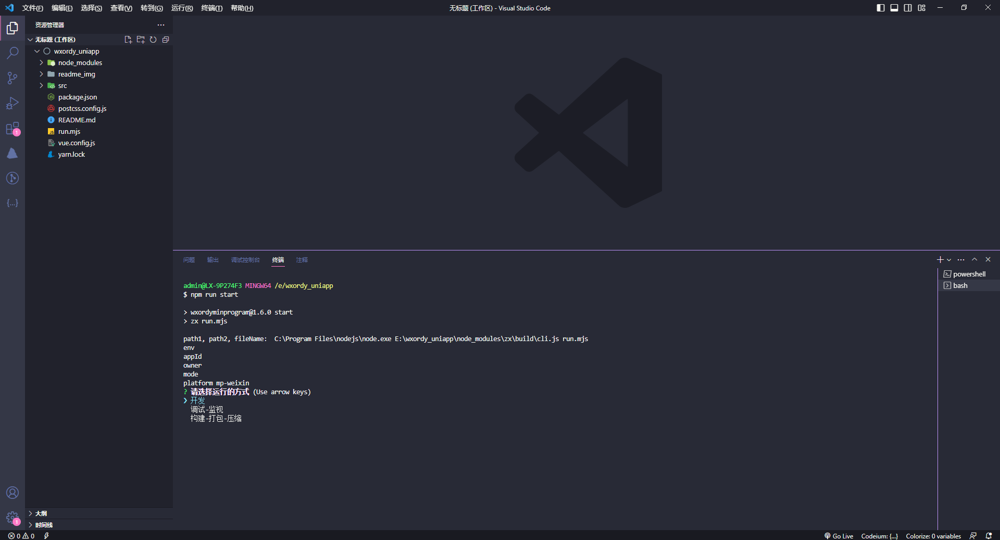
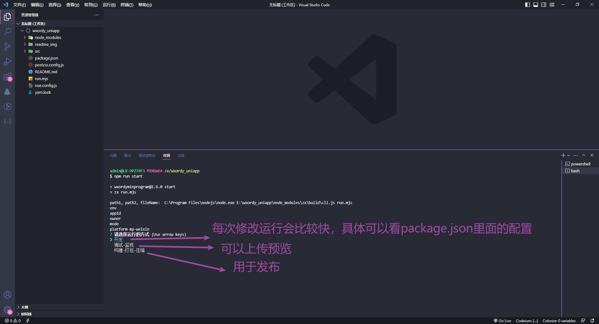
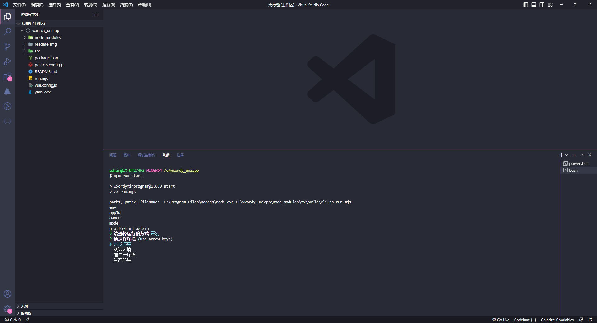
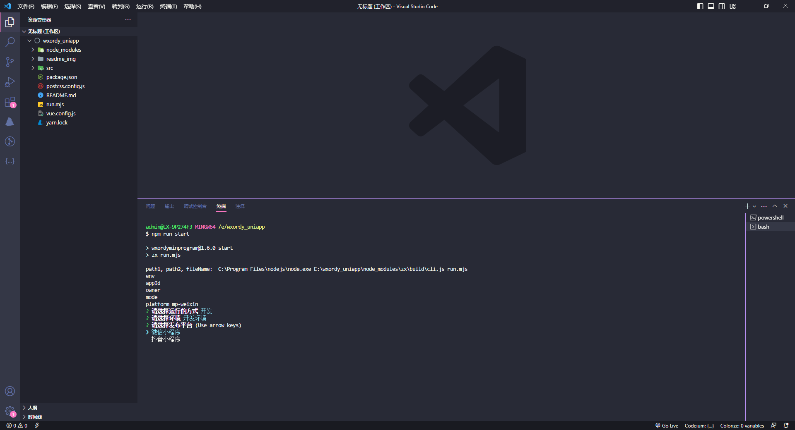
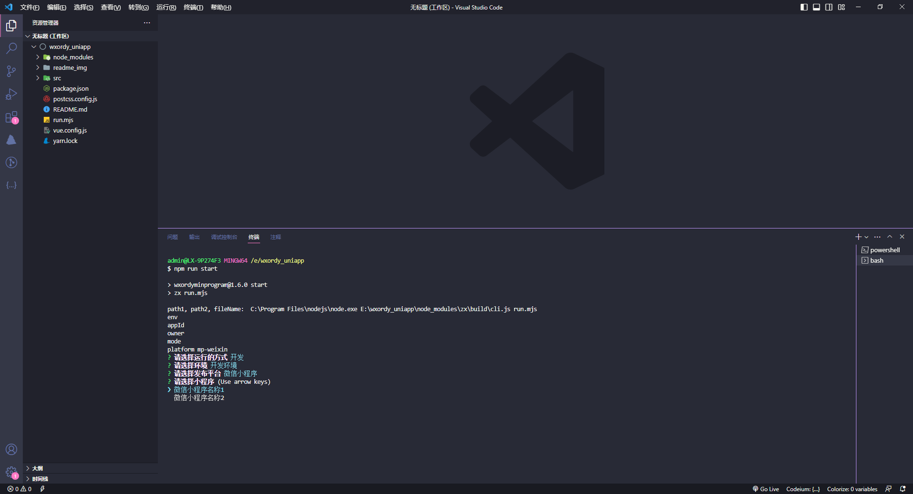
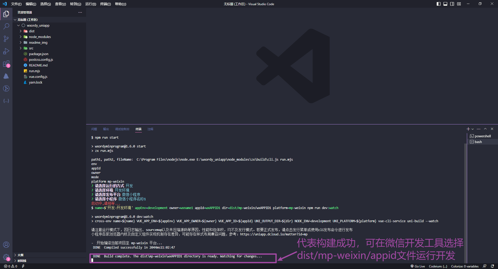

### 一套代码打包多个微信小程序

### 简介
此项目是用来免除手动替换小程序appid的烦恼。有些公司会在开发环境是一个appid，测试，准生产，生产又是另一个appid，避免我们每次手动填写的烦恼

### 安装
- Node.js 14.19.0以上
- git
- Visual Studio Code
- yarn或者pnpm，因为安装依赖差异问题，最好使用这两种

### 启动
1、需要在vscode中的终端切换git终端才能执行成功（如下面的“开发步骤”所提示）
2、执行 npm run start/pnpm run start/yarn run start
3、根据终端提示上线箭头选择执行（如下面的“开发步骤”所提示）

### 开发步骤

### 结构

    toc-weapp 
    ├── dist 构建后才会出现
    |  ├── mp-toutiao 抖音小程序目录
    |  |  ├── dyAPPID1 抖音小程序appid
    |  |  ├── dyAPPID2 抖音小程序appid
    |  ├── mp-weixin 微信小程序目录
    |  |  ├── wxAPPID1 微信小程序appid
    |  |  ├── wxAPPID2 微信小程序appid
    ├── node_modules
    ├── readme_img 截图展示
    ├── src
    |  ├── apps
    |  |  ├── mp-toutiao 抖音小程序配置目录
    |  |  |  ├── dyname1.config.js 注意：dyname1是自定义的一个名称，一般是将抖音小程序中文名转成英文，与根目的run.mjs中的owner一定要对应上
    |  |  |  ├── dyname2.config.js
    |  |  ├── mp-weixin 微信小程序配置目录
    |  |  |  ├── wxname1.config.js
    |  |  |  ├── wxname2.config.js
    |  ├── config 小程序配置（本地）
    |  ├── pages
    |  |  ├── index
    |  |  |  ├── index
    |  ├── App.vue  
    |  ├── main.js  入口 js 文件
    |  ├── manifest.json
    |  ├── pages.json 页面路由配置文件
    |  ├── uni.scss
    ├── package.json
    ├── postcss.config.js
    ├── README.md
    ├── run.mjs 整个项目的核心文件，运行配置都在里面
    ├── vue.config.js
    └── yarn.lock